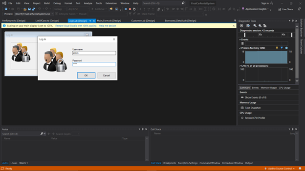
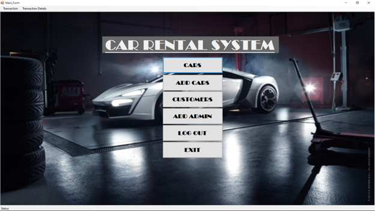
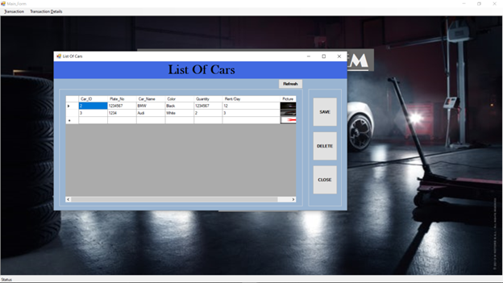
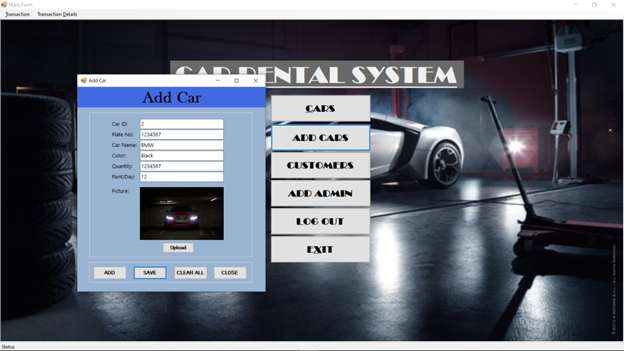
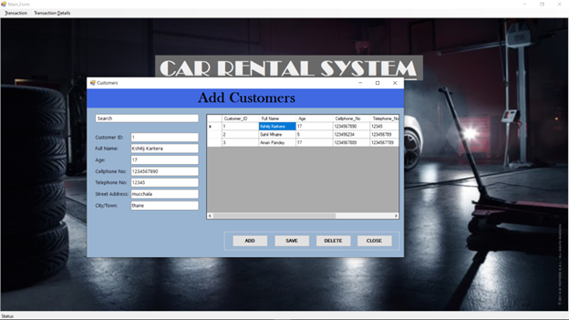
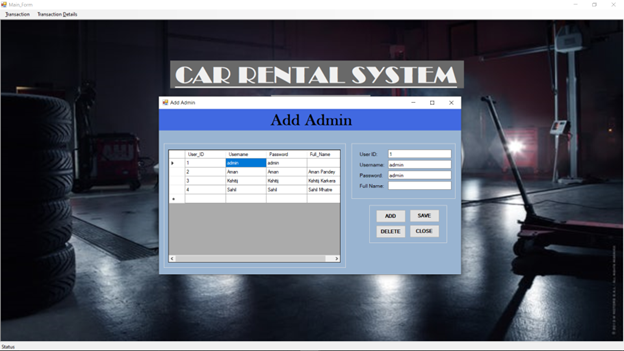
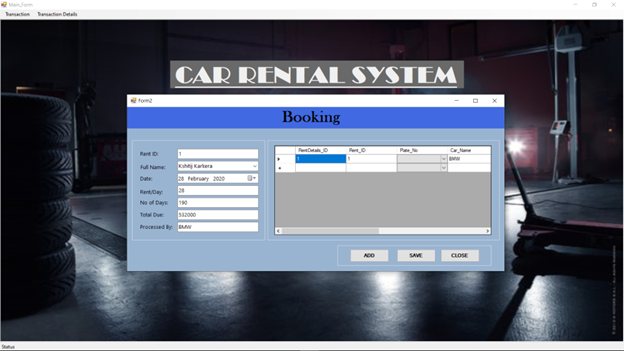

# Car Rental System using VB.NET
The Car Rental System is a desktop application developed in VB.NET, integrated with a Microsoft Access database. This system streamlines car rental operations, providing an intuitive interface for managing cars, customers, admins, and booking transactions.

## Features
- **Login System**: Secure authentication for admins and users.
- **Car Management**: Add, view, edit, and delete car details, including images, quantity, and rental costs.
- **Customer Management**: Add, view, edit, and delete customer information such as name, contact details, and address.
- **Admin Management**: Manage admin accounts with options to add, edit, and delete admins.
- **Booking System**: Create, view, and save booking records, including customer details, rental duration, and total cost.
- **User-Friendly Interface**: Simple navigation with distinct sections for each operation.

## Screenshots

## Screenshots
**Login Page**

**Home Page**

**List of Cars**

**Add Car**

**Add Customers**

**Add Admin**

**Book a Car**

**Borrowed Car Details**

